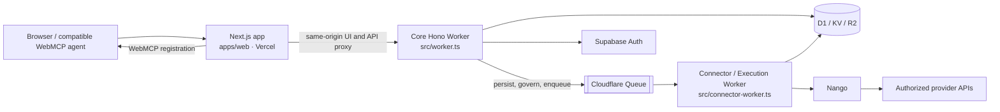
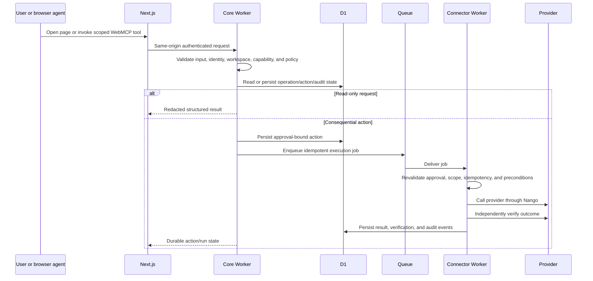

# AmbiOS AI architecture

AmbiOS is a WebMCP-first operations workspace. People use the Next.js application directly; compatible browser agents can discover the page’s scoped `ambios.*` tools. The server remains the authority for identity, workspace scope, policy, approvals, provider execution, verification, and audit.

## Runtime shape

Vercel hosts the Next.js runtime. Cloudflare hosts backend logic only. The Core Worker handles authenticated domain reads, policy, approvals, audit, canvas data, and queue production. The Connector Worker is the sole queue consumer and owns provider calls, webhooks, retries, and independent verification.

## Repository map

| Path | Responsibility |
| --- | --- |
| `apps/web/src/app/` | Next.js routes, layouts, loading/error boundaries, and API proxy routes |
| `apps/web/src/components/` | Shared UI, agent workspace, navigation, Canvas, forms, and state presentation |
| `apps/web/src/lib/` | Browser API client, auth helpers, WebMCP mounting, and client utilities |
| `src/hono-app.ts` | Core HTTP operations and domain handlers |
| `src/mcp-routes.ts` | MCP resource, OAuth, JSON-RPC, and tool request boundary |
| `src/worker.ts` | Core Worker entry point and Cloudflare bindings |
| `src/connector-worker.ts` | Connector/Execution Worker entry point, webhooks, and queue consumer |
| `packages/db/` | D1 schema, migrations, and seed tooling |
| `packages/api/` | Shared API contracts and validation |
| `packages/shared/` | Shared domain types, operation metadata, and serialization helpers |
| `packages/env/` | Environment validation for browser, server, and Worker runtimes |
| `webmcp/` | Tool registry, schemas, evaluations, documentation, and verification records |
| `tests/` | Contract, integration, security, smoke, and browser tests |
| `scripts/` | Build gates, route checks, smoke checks, deployment helpers, and audits |

## Entry points and ownership

| Entry point | Runtime | Edit here for |
| --- | --- | --- |
| `apps/web/src/app/layout.tsx` | Next.js | Global metadata, providers, and document shell |
| `apps/web/src/app/(dashboard)/layout.tsx` | Next.js | Authenticated application shell and dashboard layout |
| `apps/web/src/app/api/[...path]/route.ts` | Next.js | Same-origin forwarding to the Core Worker |
| `apps/web/src/proxy.ts` | Next.js | Browser-side route protection and redirects |
| `apps/web/src/lib/api/` | Browser | Typed API calls and response/error parsing |
| `webmcp/register.ts` | Browser | Canonical browser tool registration and feature detection |
| `src/hono-app.ts` | Core Worker | Domain HTTP operations, auth checks, scope, persistence, and audit |
| `src/mcp-routes.ts` | Core Worker | MCP metadata, OAuth authorization-code flow, JSON-RPC, and tool dispatch |
| `src/connector-worker.ts` | Connector Worker | Nango/provider execution, webhook validation, retries, and verification |
| `packages/db/migrations/` | D1 | Forward-only schema changes |
| `packages/shared/operations.ts` | Shared | Operation identifiers and route metadata |
| `openapi.yaml` | Contract | Public API contract; update with route changes |

## Request and action flow

The browser and model are untrusted callers. A visible button, chat confirmation, WebMCP schema, or model response cannot approve or authorize a provider write.

## Authentication and data boundaries

Supabase Auth is the identity authority. Workers verify the bearer session server-side, then resolve organization and workspace membership before returning data. Provider credentials remain in Nango or runtime secret storage. D1 stores connection metadata, mappings, action state, audit records, and verification evidence—not provider tokens.

The MCP boundary has its own OAuth authorization-code flow with PKCE. MCP authorization grants scoped access to AmbiOS; it does not grant provider access or approval for a consequential action. Public MCP responses use safe schemas rather than serializing internal D1 records.

## WebMCP

`webmcp/register.ts` exposes the canonical `ambios.*` catalog through `navigator.modelContext` when the compatible browser API is available. Tool definitions include schemas, availability, scope, audit requirements, and safety annotations. The current release catalog contains 29 definitions; the frontend mounts the verified read-only subset. See [WebMCP documentation](./webmcp/AMBIOS.md) and [verification](./webmcp/VERIFICATION.md) for the current evidence boundary.

## Persistence and asynchronous work

- D1 is the durable source for workspace, incident, action, approval, operation, mapping, audit, and verification records.
- KV is used for bounded ephemeral controls such as rate limiting or short-lived coordination where the owning operation permits it.
- R2 is reserved for bounded artifacts rather than request or credential storage.
- Cloudflare Queues separate provider-dependent work from the request path. Consumers must be idempotent and record retry state.
- Webhooks are signature-checked, replay-bounded, deduplicated, normalized, and then queued; receipt alone never authorizes execution.

## Change paths

1. Identify the runtime owner and read [Feature status](./docs/FEATURE-STATUS.md).
2. Search for the existing operation, schema, client, status, and test.
3. Read the relevant ADR before changing topology, auth, data, provider scope, or WebMCP behavior.
4. Change implementation, contract, UI state, audit behavior, and tests together.
5. Run focused checks, then the repository gate: `pnpm production:gate`.
6. Record deployed or external evidence in [release evidence](./docs/RELEASE-EVIDENCE.md) and [WebMCP verification](./webmcp/VERIFICATION.md).

## Verification boundary

Local typecheck, lint, tests, and builds prove repository behavior only. Deployed HTTPS checks prove the deployed routes. Authenticated browser, provider, OAuth, and external WebMCP claims require their own current evidence. Never upgrade an “implemented locally”, “unverified”, “not configured”, or “unsupported” status to “verified” without that evidence.
