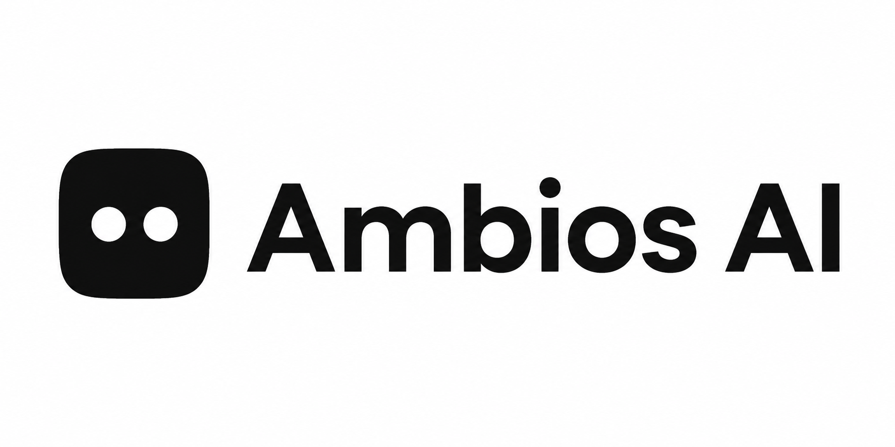

<div align="center">
  
  <h1>AmbiOS AI</h1>
  <p><strong>Human judgment and agent action, in one operational workspace.</strong></p>
  <p>AmbiOS gives AI agents structured context, guardrails, and reviewable actions so teams can resolve operational work safely.</p>
  <p><a href="#quick-start">Quick Start</a> · <a href="#mvp-workflow">MVP Workflow</a> · <a href="./CONTRIBUTING.md">Contributing</a> · <a href="./LICENSE">License</a></p>
</div>

## What is AmbiOS AI?

AmbiOS is a WebMCP-native collaboration layer for humans and software agents. It combines an operational workspace, incident response, agent activity, guardrails, documentation proposals, budgets, and integrations behind shared API logic.

| Capability | Purpose | MVP status |
| --- | --- | --- |
| Workspace Canvas | See the active organization, agent, and operational context | Available |
| Agent Activity Console | Review actions created by agents | Available |
| Incident hot-fix | Run a context-aware, reviewable action | Available |
| Docs proposals | Capture proposed runbook updates for human review | Available |
| WebMCP | Expose `ambios.*` tools to compatible agent clients | Available |
| Guardrails | Block destructive instructions and require review | Available |
| Nango, Xendit, Resend | Integration scaffolds and configuration surfaces | Scaffolded |
| Cloudflare D1, KV, R2, Queues | Edge deployment bindings and D1 schema target | Scaffolded |

## Quick Start

### Prerequisites

- Node.js 20+
- pnpm 10+
- Supabase credentials for authenticated mode
- PostgreSQL credentials for the Drizzle backend path

```sh
pnpm install
cp .env.example .env
pnpm dev:web
```

Open [http://localhost:3001](http://localhost:3001). Without Supabase keys, the app runs in local fixture mode so the MVP workflow can be inspected. Configure Supabase before using authenticated environments.

## MVP Workflow

1. Open `/workspace` and inspect the active organization and agent.
2. Open `/incidents` and select the sample checkout latency incident.
3. Run the hot-fix with a short instruction.
4. Review the completed action in `/console`.
5. Review the generated documentation proposal in `/docs`.

| WebMCP tool | Input | Result |
| --- | --- | --- |
| `ambios.list_incidents` | None | Incident list |
| `ambios.get_workspace` | None | Workspace context, actions, and docs |
| `ambios.run_hotfix` | `incidentId`, `instruction` | Action and doc proposal |

WebMCP registration is progressive enhancement. Human UI routes remain usable when the browser does not expose `document.modelContext`.

## Project Structure

```text
ambios-ai/
├── apps/web/                 # Next.js application and route handlers
│   └── src/app/(dashboard)/  # Workspace, console, incidents, docs, budget, plugins
├── packages/api/             # Shared tRPC routers
├── packages/db/              # Drizzle schema and Cloudflare D1 schema
├── packages/auth/            # Supabase Auth integration
├── packages/infra/           # Cloudflare infrastructure package
├── public/assets/banner.png  # README/project banner
├── docs/ADR/                 # Product decision records
└── wrangler.toml             # D1, KV, R2, and Queues bindings
```

## Commands

| Command | Description |
| --- | --- |
| `pnpm dev:web` | Start the Next.js application |
| `pnpm build` | Build all workspaces |
| `pnpm check-types` | Typecheck all workspaces |
| `pnpm test` | Run Vitest suites |
| `pnpm lint` | Run workspace lint checks |
| `pnpm db:push` | Push the PostgreSQL/Drizzle schema |
| `pnpm db:migrate` | Run PostgreSQL migrations |
| `pnpm dlx wrangler deploy --dry-run --config wrangler.toml` | Validate the Worker deployment bundle |

## Configuration

Copy `.env.example` to `.env` and fill only the services used by your environment. Supabase remains the authentication authority. Nango, Xendit, Resend, Cloudflare, and provider keys are optional for the local MVP workflow.

The Cloudflare D1 target schema is [packages/db/schema-d1.sql](./packages/db/schema-d1.sql). Wrangler bindings are defined in [wrangler.toml](./wrangler.toml).

## Documentation

- [Architecture](./ARCHITECTURE.md)
- [Roadmap](./docs/ADR/ROADMAP.md)
- [Draft](./docs/DRAFT.md)
- [PRD](./docs/PRD.md)
- [Customer](./docs/CUSTOMER.md)
- [Pitch](./docs/PITCH.md)
- [Security policy](./SECURITY.md)
- [Contribution guide](./CONTRIBUTING.md)
- [Change history](./CHANGELOG.md)

## Contributing

Read [CONTRIBUTING.md](./CONTRIBUTING.md) before opening a pull request. Run typecheck, tests, build, and lint checks for code changes. Security-sensitive reports should follow [SECURITY.md](./SECURITY.md).

## License

AmbiOS AI is released under the [MIT License](./LICENSE). Community behavior is governed by the [Code of Conduct](./CODE_OF_CONDUCT.md).

<div align="center"><sub>Built for safer human-and-agent collaboration by <a href="https://github.com/JustineDevs">@Justinedevs</a>.</sub></div>
