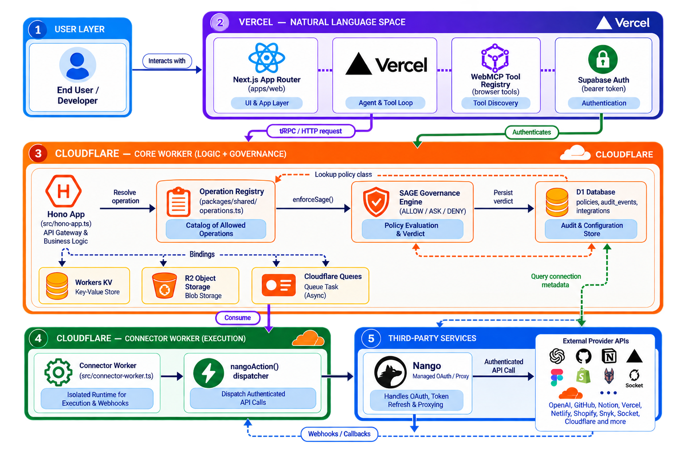

<div align="center">
  
  <a href="./ARCHITECTURE.md"></a>
  <p><a href="./ARCHITECTURE.md">Architecture overview</a> · <a href="./docs/CODEBASE-MAP.md">Codebase map</a> · <a href="./docs/RELEASE-EVIDENCE.md">Release evidence</a></p>
  <p><strong>Human judgment and agent action, in one operational workspace.</strong></p>
  <p>Structured context, guardrails, approvals, and reviewable actions for safer AI-assisted operations.</p>
  <p><a href="#webmcp-at-a-glance">WebMCP</a> · <a href="#quick-start">Quick Start</a> · <a href="#mvp-workflow">MVP Workflow</a> · <a href="./CONTRIBUTING.md">Contributing</a> · <a href="./LICENSE">License</a></p>
</div>

## What is AmbiOS AI? [](https://deepwiki.com/JustineDevs/ambios-ai) [](https://webmcp.devpost.com/) [](./package.json)

AmbiOS is a WebMCP-native collaboration platform for humans and software agents. It combines operational context, incident response, agent activity, guardrails, documentation proposals, budgets, and integrations behind shared API logic.

## WebMCP at a glance

WebMCP is the challenge focus: AmbiOS gives a compatible browser agent a controlled way to inspect the operational workspace that is already open in the browser. The agent can discover useful context, while AmbiOS keeps authentication, workspace scope, policy, approval, execution, verification, and audit decisions on the server.

| Primitive | Role in AmbiOS |
| --- | --- |
| `navigator.modelContext` | Browser capability used to mount tools only when the current page and compatible browser support WebMCP. |
| Canonical `ambios.*` registry | One typed catalog for tool names, schemas, availability, safety annotations, and backend operation ownership. |
| Scoped tool schemas | Keep inputs and public outputs narrow, typed, redacted, and tied to the signed-in workspace. |
| Read/write safety annotations | Tell the browser agent whether a tool reads state, persists a proposal, or can affect an external provider. |
| Server-side governance | Re-checks identity, scope, capability, policy, approval, and audit requirements; browser or model output is never authority. |

The current release catalogs 29 tools and mounts 18 read-only tools in a compatible browser. Consequential tools remain unavailable until their provider adapter, approval path, verification evidence, and external side-effect behavior are proven. Read the [WebMCP implementation](./webmcp/AMBIOS.md) and [verification boundary](./webmcp/VERIFICATION.md) for the precise claim.

## Built with

The production shape is intentionally split: Next.js is the user-facing application, Hono Workers own the API and governance boundary, and external services are connected only through server-side adapters. The linked architecture and status documents explain the boundaries and evidence behind these technologies.

<p>
  <a href="https://nextjs.org/" title="Next.js"></a>&nbsp;
  <a href="https://vercel.com/" title="Vercel"></a>&nbsp;
  <a href="https://developers.cloudflare.com/workers/" title="Cloudflare Workers"></a>&nbsp;
  <a href="https://openai.com/" title="OpenAI"></a>&nbsp;
  <a href="https://supabase.com/" title="Supabase Auth"></a>&nbsp;
  <a href="https://nango.dev/" title="Nango"></a>&nbsp;
  <a href="https://www.netlify.com/" title="Netlify provider adapter"></a>&nbsp;
  <a href="https://www.shopify.com/" title="Shopify provider adapter"></a>&nbsp;
  <a href="https://www.xendit.co/" title="Xendit integration surface"></a>&nbsp;
  <a href="https://resend.com/" title="Resend integration surface"></a>
</p>

| Capability | Purpose | Status |
| --- | --- | --- |
| Workspace Canvas | Inspect persisted workspace, incident, system, action, and documentation relationships | Implemented locally; external browser evidence required |
| Agent Activity Console | Review durable agent and human action records | Implemented locally; deployed D1 evidence required |
| Context-aware hot-fix | Propose and execute an exact-scope, approval-gated action | Implemented locally; provider execution and verification unverified |
| Documentation proposals | Capture reviewable runbook changes linked to operational context | Implemented locally |
| WebMCP | Expose the safe `ambios.*` catalog to compatible browsers | 29 catalogued; 18 read-only tools mounted; authenticated execution unverified |
| Nango and provider adapters | Connect authorized services without placing provider credentials in the browser | Not configured until connection, capability, and mapping evidence exists |
| Cloudflare D1, KV, R2, Queues | Persist governance records and separate long-running execution from requests | Runtime configured; production binding evidence is tracked separately |

For the exact boundary between implemented, verified, unverified, unsupported, and planned behavior, see [Feature status](./docs/FEATURE-STATUS.md). For the full runtime topology and integration responsibilities, see [Architecture](./ARCHITECTURE.md). For reviewer-facing behavior, see the [Judge onboarding guide](./docs/JUDGE-ONBOARDING.md).

## Quick Start

Use the production app at [ambios-ai.vercel.app](https://ambios-ai.vercel.app). No local setup or commands are needed.

1. Open AmbiOS and sign in.
2. Select your workspace.
3. If the navigation is collapsed, use the sidebar menu toggle; open **Agent** and confirm the workspace is ready.
4. Open **ChatGPT Desktop** or another compatible browser agent with WebMCP enabled. Keep the AmbiOS tab active.
5. Open the browser agent’s side panel and ask:

   > “Use AmbiOS WebMCP to inspect my current workspace readiness and context. Report the workspace status, available capabilities, and any setup blocker. Do not create a proposal, request approval, connect a provider, or execute a write. Then open AmbiOS Tools so I can review the available tools and open Runs to review the inspection.”

The agent should discover the mounted `ambios.*` WebMCP tools and return a scoped read-only result. If no tools appear, make sure WebMCP is enabled, the AmbiOS tab is active, and you are signed in to the production app. For local development and technical verification, use the [Developer Onboarding guide](./docs/DEVELOPER-ONBOARDING.md). For review instructions, use the [Judge Onboarding guide](./docs/JUDGE-ONBOARDING.md).

## MVP Workflow

The following is the target workflow documented by the product requirements. The current local Hono runtime mounts the operational route families, with authenticated D1-backed reads and record-only action paths where provider execution is not configured. Provider execution, independent provider verification, and deployed authenticated evidence remain explicitly unverified until their external dependencies are available.

1. Configure authentication and establish a workspace session.
2. Open `/agent` and inspect workspace readiness.
3. Review incidents, proposed actions, and required approvals.
4. Execute only an exact-scope, one-time approved action.
5. Confirm independent verification and the audit record in Runs, Console, and Canvas.

## WebMCP implementation details

The repository contains twenty-nine `ambios.*` WebMCP contract definitions. The current frontend mounts the safe read-only subset when the browser exposes `navigator.modelContext`; write-capable tools remain excluded until their backend adapters and authenticated browser evidence exist. See [WebMCP documentation](./webmcp/AMBIOS.md), the [verification log](./webmcp/VERIFICATION.md), and the [judge onboarding guide](./docs/JUDGE-ONBOARDING.md).

Nango remains an external connector dependency for provider-backed features; local development does not require a provider connection for the health/readiness path. Provider-backed flows stay unavailable until Nango credentials, provider configuration, capability scope, and resource mappings are verified.

## Project Structure

```text
ambios-ai/
├── apps/web/          # Next.js frontend (Vercel)
├── packages/db/       # D1 schema and migrations
├── packages/api/      # Shared contracts and API types
├── packages/infra/    # Cloudflare deployment helpers
├── webmcp/            # WebMCP tools and verification
├── tests/             # Contract and integration tests
└── wrangler.toml      # Worker and resource bindings
```

## Configuration

Copy `.env.example` to `.env`. Supabase is the authentication authority. Nango manages external provider connections; Cloudflare, payment, and email secrets are server/runtime configuration only. Never commit `.env` or provider credentials.

Before deployment, populate `AMBIOS_D1_DATABASE_ID` and `AMBIOS_KV_NAMESPACE_ID` with resources from the target Cloudflare account, enable R2, and run `pnpm cloudflare:preflight`. The Cloudflare deployment token needs only the Worker, D1, KV, R2, and Queues permissions required by the two Hono deployments; the Vercel deployment uses its separate Vercel token, organization ID, and project ID.

The production deployment is intentionally split: the full Next.js application is published to Vercel, while the Hono Core and Connector/Execution Workers own API, WebMCP gateway, D1/KV/R2, queues, Nango, and provider execution. Vercel rewrites same-origin `/api/*`, `/mcp`, and `/health` to the Workers. No Next.js runtime is deployed to Cloudflare.

## Documentation

<table>
  <tbody>
    <tr>
      <td><a href="./docs/ONBOARDING.md">Onboarding</a></td>
      <td><a href="./docs/DEVELOPER-ONBOARDING.md">Developer</a></td>
      <td><a href="./docs/CONTRIBUTOR-ONBOARDING.md">Contributor</a></td>
    </tr>
    <tr>
      <td><a href="./docs/JUDGE-ONBOARDING.md">Judge</a></td>
      <td><a href="./docs/CODEBASE-MAP.md">Codebase map</a></td>
      <td><a href="./docs/FEATURE-STATUS.md">Feature status</a></td>
    </tr>
    <tr>
      <td><a href="./docs/ENGINEERING-STANDARDS.md">Engineering standards</a></td>
      <td><a href="./docs/GOVERNANCE.md">Governance</a></td>
      <td><a href="./docs/DEVELOPMENT-PROCESS.md">Development process</a></td>
    </tr>
    <tr>
      <td><a href="./docs/CI-CD.md">CI/CD</a></td>
      <td><a href="./docs/RELEASE-EVIDENCE.md">Release evidence</a></td>
      <td><a href="./ARCHITECTURE.md">Architecture</a></td>
    </tr>
    <tr>
      <td><a href="./docs/ADR/ROADMAP.md">Roadmap</a></td>
      <td><a href="./docs/DRAFT.md">Draft</a></td>
      <td><a href="./docs/PRD.md">PRD</a></td>
    </tr>
    <tr>
      <td><a href="./docs/CUSTOMER.md">Customer</a></td>
      <td><a href="./docs/PITCH.md">Pitch</a></td>
      <td><a href="./SECURITY.md">Security policy</a></td>
    </tr>
    <tr>
      <td><a href="./CONTRIBUTING.md">Contribution guide</a></td>
      <td><a href="./CHANGELOG.md">Change history</a></td>
      <td><a href="./CODE_OF_CONDUCT.md">Code of Conduct</a></td>
    </tr>
  </tbody>
</table>

## License

AmbiOS AI is released under the [MIT License](./LICENSE). Community behavior is governed by the [Code of Conduct](./CODE_OF_CONDUCT.md).

<div align="center"><sub>Built for safer human-and-agent collaboration by <a href="https://github.com/JustineDevs">@Justinedevs</a>.</sub></div>
