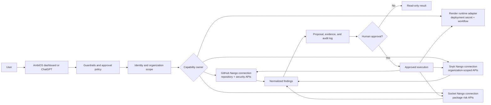

# ADR 016: Security and Render Connector Topology

**Status:** Accepted for MVP  
**Date:** 2026-09-01  
**Scope:** GitHub Security, Dependabot, Snyk, Socket.dev, Render, connector catalog, and governed user actions

## Decision summary

AmbiOS models integrations by ownership and trust boundary:

| Product | Catalog role | User connects an account? | Responsibility |
| --- | --- | ---: | --- |
| GitHub | User-owned connector | Yes | Repository context, pull requests, checks, and GitHub security APIs |
| Dependabot | GitHub capability family | No separate connection | Dependency vulnerability alerts through the authorized GitHub connection |
| GitHub code scanning | GitHub capability family | No separate connection | Code scanning alerts through GitHub |
| GitHub secret scanning | GitHub capability family | No separate connection | Secret scanning alerts through GitHub; secret values are never returned |
| Snyk | User-owned security connector | Yes | Organization-scoped dependency and project findings, scans, and reviewable remediation proposals |
| Socket.dev | User-owned security connector | Yes | Package supply-chain, malware, and dependency risk analysis |
| Render | Deployment-owned runtime | No | Service/workflow execution and status using deployment-managed secrets |

The catalog must never present a deployment runtime as an OAuth connector, and it must never require a second “Dependabot” or “GitHub Security” account when GitHub is the authorization boundary.

## User interaction topology

The user experiences one governed AmbiOS security workflow:

1. Select a repository, package, service, or incident.
2. Ask AmbiOS to inspect the relevant evidence.
3. AmbiOS resolves the owning connector and checks tenant scope, vendor permissions, rate limits, and guardrails.
4. Read-only findings are returned with vendor and resource provenance.
5. Any mutation becomes a reviewable proposal. High-impact actions require explicit human approval.
6. Approved work runs through the owning vendor boundary and is recorded in the append-only audit trail.

## Connector catalog contract

The catalog has two mutually exclusive auth modes:

- `nango`: a user-owned external account. The UI may show Connect, Continue connection, Disconnect, and Sync.
- `runtime`: a deployment-owned capability. The UI shows Deployment-managed and must not show Connect, Disconnect, or user sync controls.

The implementation applies this contract as follows:

- `github` is the single user connector for Dependabot, code scanning, and secret scanning.
- `snyk` and `socket` remain separate entries. Their metadata-only status is honest until verified vendor adapters and production credentials are configured.
- `render` is an MVP catalog entry with runtime ownership. Its API key and workflow task configuration remain server-side.
- `dependabot` and `github-security` are not catalog providers and are not accepted by the Nango connection endpoint.

## Vendor-aligned boundaries

### GitHub, Dependabot, and GitHub Security

GitHub is the authorization boundary. The connection receives only the repository and security permissions required by the selected capabilities. The implementation maps capability kind to official GitHub REST resources:

- Dependabot: `repos/{owner}/{repo}/dependabot/alerts`
- Code scanning: `repos/{owner}/{repo}/code-scanning/alerts`
- Secret scanning: `repos/{owner}/{repo}/secret-scanning/alerts`

The user supplies an explicit `owner/repository` resource. AmbiOS validates repository shape, preserves pagination, sends the current GitHub API version and media headers, and returns alert metadata—not secret values. Remediation is separate from alert reading and requires a human approval policy.

References: [Dependabot alerts](https://docs.github.com/en/rest/dependabot/alerts), [code scanning](https://docs.github.com/en/rest/code-scanning/code-scanning), and [secret scanning](https://docs.github.com/en/rest/secret-scanning/secret-scanning).

### Snyk

Snyk is organization-scoped. A finding request must carry or resolve an explicit Snyk organization ID; `rest/orgs/issues` without `{org_id}` is not a tenant-safe contract. The API version must be configured centrally and the region-specific Snyk base URL must be respected. Tokens remain server-side, and response data is normalized only after upstream status and schema checks.

Read findings come first. Scan and remediation capabilities must advertise a real upstream adapter and approval behavior; an action name alone is not evidence that a vendor operation is wired.

References: [Snyk REST API](https://docs.snyk.io/snyk-api/rest-api) and [Snyk issues API](https://docs.snyk.io/snyk-api/reference/issues).

### Socket.dev

Socket is a package supply-chain analysis boundary. Package input is represented as a valid Package URL (PURL), such as `pkg:npm/example@1.2.3`; ecosystem, name, and version are validated before constructing it. Package analysis, report lookup, and malware analysis are distinct read capabilities, and every result requires upstream status and schema validation.

References: [Socket PURL](https://docs.socket.dev/reference/socket-package-urls-purl) and [Socket package analysis](https://docs.socket.dev/docs/socket-package).

### Render

Render is not a user account connector for this product. Render API keys are deployment secrets and must never be exposed through the browser or stored as Nango user connection metadata. The runtime adapter owns:

- starting only an explicitly named, allow-listed workflow task;
- passing JSON-serializable, size-bounded input;
- reading task-run status and result;
- retry and timeout policy;
- approval enforcement before deployment-affecting actions;
- correlation IDs connecting a workflow run to the AmbiOS incident and audit record.

The existing `packages/workflows` package is the Render workflow boundary and uses the official `@renderinc/sdk`. The web catalog exposes that runtime boundary; it does not pretend a browser user can connect Render through OAuth.

References: [Render API](https://render.com/docs/api), [Render Workflows](https://render.com/docs/workflows), [running workflow tasks](https://render.com/docs/workflows-running), and [defining workflow tasks](https://render.com/docs/workflows-defining).

## Current wiring and remaining gaps

### Wired in this MVP slice

- Catalog ownership is explicit (`nango` versus `runtime`).
- Render appears as a deployment-managed MVP entry with no Connect or Sync behavior.
- Dependabot and GitHub Security are represented under GitHub capability actions.
- The Nango connection contract excludes Render and the standalone GitHub security names.
- The shared security wrapper remains the enforcement point for identity, organization scope, rate limits, guardrails, approval, vendor request, and audit.

### Required before every security action is production-ready

- Store or resolve the Snyk organization ID per authorized workspace and use `/rest/orgs/{org_id}/issues`.
- Centralize vendor API versions and regional base URLs.
- Replace any Nango action name without a configured, verified upstream operation with an explicit unavailable/metadata-only state.
- Add pagination, upstream schema validation, timeout handling, and vendor correlation IDs to each adapter.
- Add a Render workflow status/start adapter behind the runtime boundary, using an allow-list of task slugs and deployment-managed `RENDER_API_KEY`.
- Add contract/evaluation cases for denied tenant scope, missing vendor permission, revoked connection, upstream 401/403/429/5xx, malformed package/repository input, and approval rejection.

## Acceptance criteria

This decision is correctly implemented when:

- users can identify why each catalog entry exists and whether they personally connect it;
- Dependabot and GitHub Security never appear as duplicate connection buttons;
- Render never asks for a browser credential or user OAuth consent;
- every security result identifies its vendor and resource scope;
- no token or secret-scanning secret value reaches the client or audit payload;
- mutating work cannot bypass guardrails or human approval;
- vendor failures remain attributable and retryable without being treated as success;
- WebMCP tools and the dashboard use the same capability names and ownership rules.
