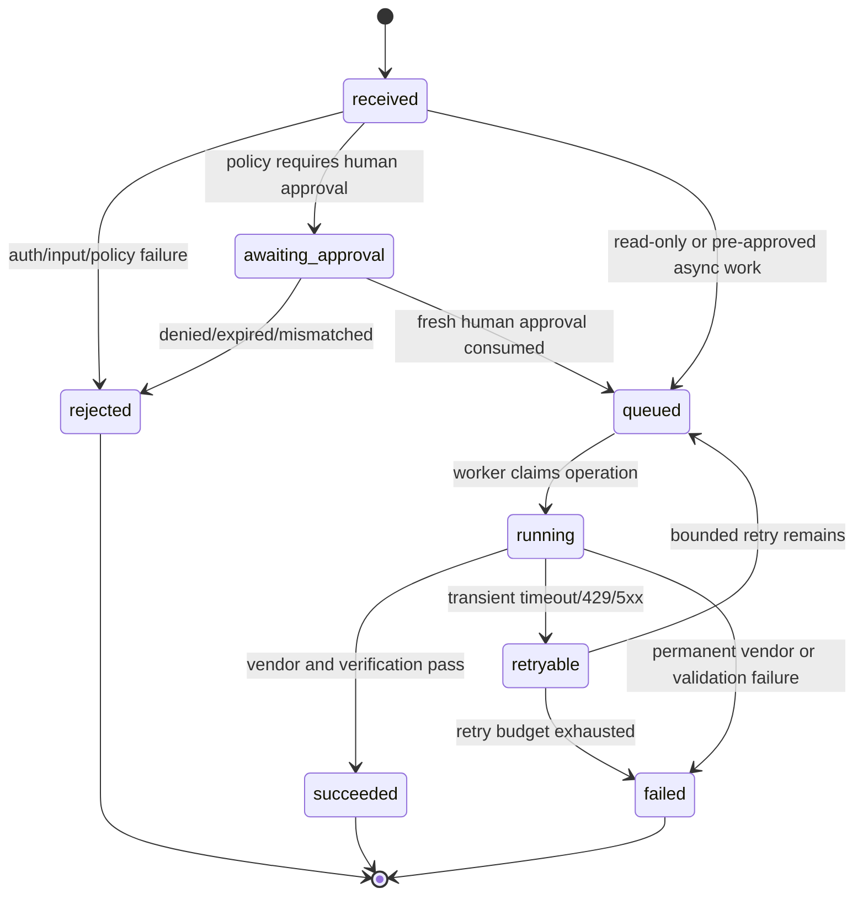

# ADR 018: End-to-End State and Failure Contract

**Status:** Proposed for Flow review  
**Date:** 2026-09-01  
**Scope:** User actions, WebMCP, REST routes, approvals, budgets, connectors, queues, Render workflows, and audit

## Decision

AmbiOS must represent every agent-requested operation as a durable action with one correlation ID, one tenant scope, one capability owner, and an explicit terminal outcome. UI state, WebMCP responses, REST responses, queue jobs, vendor calls, and audit records must be projections of the same operation state—not independent interpretations.

## Actors

- **User:** initiates intent and provides approval where required.
- **Agent:** proposes or requests an operation; never grants its own approval.
- **AmbiOS policy plane:** authenticates, resolves organization scope, validates input, evaluates guardrails, checks permissions and budget, and records audit evidence.
- **Vendor adapter:** calls GitHub, Snyk, Socket, Nango, or Render through the owning boundary.
- **Queue/Workflow runtime:** performs durable asynchronous work and reports progress.
- **UI/WebMCP adapter:** presents discoverable capabilities and current operation state.

## Canonical operation states

Terminal states are `succeeded`, `rejected`, and `failed`. `awaiting_approval`, `queued`, `running`, and `retryable` are non-terminal and must be visible to the user with a next action or retry policy.

## Main flows

### Read-only investigation

1. User or agent submits a typed request.
2. AmbiOS authenticates the user and resolves exactly one organization.
3. Capability registry resolves provider, scopes, risk, and endpoint.
4. Input is validated and normalized.
5. Policy, tenant scope, rate limit, and connector readiness are checked.
6. Vendor adapter performs the read.
7. Response is schema-checked, provenance-tagged, redacted as needed, audited, and returned.

### Proposed change

1. Read context and evidence first.
2. Produce a proposal with affected resource, expected effect, risk, cost, and rollback.
3. Persist proposal as pending review.
4. User approves or rejects the proposal in the UI.
5. Approval creates a short-lived, single-use, operation-bound approval grant.

### Approved execution

1. Re-authenticate and re-check organization membership and role.
2. Validate the approval grant against operation, resource, instruction, and expiry.
3. Reserve budget and persist the operation before external side effects.
4. Execute through the owning adapter.
5. Verify resulting state through a read-after-write check.
6. Settle budget, persist final action state, and record vendor evidence.
7. If asynchronous, return `queued` with a run ID and expose status polling/subscription.

## Failure flows

| Failure | Required behavior |
| --- | --- |
| Unauthenticated | Reject before organization lookup or vendor call; no sensitive detail |
| Multiple/no organization membership | Reject with deterministic onboarding state |
| Invalid resource input | Reject before policy or vendor call; identify field only |
| Missing connector | Return actionable `connector_required`; never silently use a fixture |
| Guardrail deny | Persist rejected audit decision; do not issue approval or call vendor |
| Approval expired/mismatched/reused | Reject; do not spend budget or call vendor |
| Budget unavailable | Reject or release reservation; never report execution |
| Vendor 401/403 | Mark connector unhealthy or unauthorized; do not retry blindly |
| Vendor 429/5xx/timeout | Mark retryable with bounded backoff and visible status |
| Queue dispatch failure | Mark operation failed and allow retry with the same idempotency key |
| Worker crash after side effect | Reconcile by operation ID/read-after-write before retrying |
| Verification mismatch | Mark failed/needs review; do not claim success |
| WebMCP unsupported | Keep dashboard usable and show browser capability status |

## Invariants

1. An agent cannot approve its own action.
2. No vendor request occurs without authenticated tenant scope.
3. No mutation occurs without a matching, fresh, human approval grant when policy requires one.
4. Approval grants are single-use and bound to the exact operation and resource.
5. Every external side effect has an idempotency key or an adapter-specific reconciliation key.
6. Every operation has one durable audit record lineage, including rejection and failure.
7. Runtime secrets never enter browser bundles, WebMCP tool input, client responses, or audit payloads.
8. A successful HTTP response means only the state explicitly declared by the contract; `queued` is not `succeeded`.
9. Third-party or user-authored content is untrusted data and cannot modify policy, tool selection, or authorization.
10. Tenant queries always include organization scope; resource identifiers alone are insufficient authorization.

## Race conditions and current risks

### Hotfix side-effect window

The current hotfix flow consumes the approval token, audits approval, creates the hotfix/doc records, settles budget, and completes idempotency in separate operations. A crash after the side effect but before idempotency completion can leave a pending idempotency row and a consumed approval token. Retrying after the ten-minute reclamation window can duplicate the result.

**Required repair:** persist a durable operation record before side effects and reconcile by operation ID. Do not reclaim a pending operation merely by age unless a worker lease/heartbeat proves it is abandoned.

### Budget settlement race

Budget reservation and settlement are guarded by status checks, but the reservation lookup and subsequent side effect are not one transaction. A worker retry or process crash must be able to settle exactly once and reconcile the external result.

### Sync dispatch race

A sync job can be marked queued, fail during queue dispatch, and later be retried using the same idempotency key. The queue payload and database row must carry the connection ID and an attempt ID consistently; a second dispatch must not create a second logical job.

### Nango webhook race

The webhook claim pattern is directionally correct: insert-or-ignore plus conditional transition prevents duplicate processing. The processing lease still needs recovery semantics if the process dies after claiming and before marking processed.

### Render asynchronous ambiguity

Render task runs are separate asynchronous executions. AmbiOS must not report a completed incident investigation merely because Render accepted a start request. Store the Render task-run identifier, map `queued/running/succeeded/failed/canceled` into AmbiOS, and verify returned results before marking the action complete.

## Missing requirements

- Canonical `operation_id` shared by HTTP request, action row, queue message, vendor call, Render run, and audit event.
- Explicit operation lease/heartbeat and recovery policy.
- Single state vocabulary across `actions`, `sync_jobs`, `security_scans`, approvals, and UI.
- Read-after-write verification contracts for every mutation.
- Cancellation semantics for queued and running Render tasks.
- User-visible polling or live updates for asynchronous work.
- A deterministic policy for fixture/local-provider mode so it cannot be confused with real execution.
- Contract tests for duplicate requests, retries after crashes, and concurrent approval/execution.

## Flow status

**Status:** BLOCKED for security gate until operation identity, side-effect reconciliation, and asynchronous Render state mapping are designed.  
**Evidence:** Existing D1 tables include idempotency, approval, budget, action, sync, webhook, and security-scan state, but they currently use separate state vocabularies and do not provide one operation lineage.  
**Next allowed trigger:** `$vet` after these blockers are accepted as implementation requirements; security review should test the invariants against every route and WebMCP tool.
